# Flow Builder: Visual Pipeline Designer & Runtime Orchestration
<!-- slide -->
<!-- Slide 1: Title & Mascot Introduction -->
# Flow Builder: Visual Pipeline Designer & Runtime Orchestration
### *Modern, Zero-Dependency ETL & Workflow Engine in Go*


> **"Slashing ETL Madness with Go, HTMX, and Declarative Pipelines"**

* **Single-Binary Engine:** No Python runtimes, Celery workers, or JVM footprint.
* **Embedded HTMX Visual Builder:** Interactive web studio served directly from the Go binary (`flow -builder`).
* **Live Bidirectional XML Sync:** Visual drag-and-drop synchronized in real time with Git-friendly declarative XML.
* **Built-in Quality Gates & Telemetry:** Full preflight validation, row-level telemetry, and compliance logging out of the box.

---

<!-- Slide 2: What is Flow & The Builder UI? -->
# What is Flow Builder Doing?
### *An Embedded Visual Studio for Declarative Data Pipelines*

Flow Builder bridges the gap between raw XML configuration and visual workflow orchestration. It runs an embedded local web server backed by an embedded SQLite database (`flow_builder.db`), allowing data engineers to visually compose, validate, test, and execute pipelines without writing boilerplate code.

```
+-----------------------------------------------------------------------------------+
|                               Flow Web Builder UI                                 |
|                                                                                   |
|  +--------------------+  +-----------------------------+  +--------------------+  |
|  | Component Palette  |  |     Interactive Canvas      |  |  Live XML Preview  |  |
|  | - Variables        |  | 1. Variables (<variables>)  |  |                    |  |
|  | - Databases        |  | 2. Databases (<databases>)  |  | <pipeline>         |  |
|  | - Preflight Checks |  | 3. Preflight (<preflight>)  |  |   <variables>...   |  |
|  | - Control Flow     |  | 4. Main Flow (<flow>)       |  |   <databases>...   |  |
|  | - Database & SQL   |  |                             |  |   <preflight>...   |  |
|  | - Key-Value Store  |  | [Drag / Reorder / Edit / Del]  |   <flow>...        |  |
|  +--------------------+  +-----------------------------+  +--------------------+  |
+-----------------------------------------------------------------------------------+
                                          |
                         +---------------------------------+
                         |  Embedded Execution Engine      |
                         |  - Preflight Quality Gates      |
                         |  - Real-Time Stream Telemetry   |
                         +---------------------------------+
```

#### Core Capabilities at a Glance:
1. **Interactive Component Toolbox:** Instant drag-and-drop or click-to-add for variables, database connections, loops, scripts, and SQL tasks.
2. **Visual Hierarchy Canvas:** Organizes pipelines into 4 distinct phases: Setup, Connections, Preflight Quality Gates, and Execution Flow.
3. **Real-time Live XML Preview:** Instant validation, bidirectional feedback, copy, and export.
4. **Execution Dashboard:** Run entire pipelines or preflight checks in isolation with live stream logs and row-count metrics.

---

<!-- Slide 3: Unified 3-Panel Designer (Slate Theme) -->
# The Builder UI: Unified 3-Panel Studio
### *Default Slate Theme with Live Synchronization*

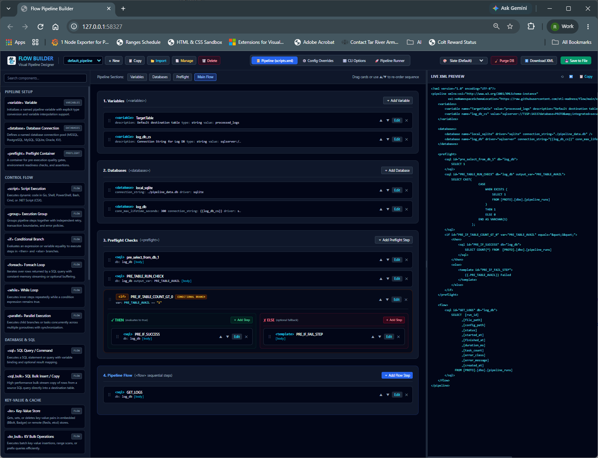

### What It's Doing:
* **Left Panel (Component Palette):** Provides organized categories of pipeline primitives:
  * **Pipeline Setup:** `<variable>`, `<database>`, `<preflight>`
  * **Control Flow:** `<script>`, `<group>`, `<if>`, `<foreach>`, `<while>`, `<parallel>`
  * **Database & SQL:** `<sql>`, `<sql_bulk>`
  * **Key-Value & Cache:** `<kv>`, `<kv_bulk>`
  * **Templates & Storage:** `<template>`, `<excel_write>`
* **Center Panel (Interactive Canvas):** Displays the active pipeline split into clear execution stages:
  1. `<variables>`: Configuration variables like `TargetTable` and connection strings (`log_db_cs`).
  2. `<databases>`: Configured connection pools (`local_sqlite`, `log_db`).
  3. `<preflight>`: Pre-execution diagnostic checks (`pre_select_from_db_1`, `PRE_TABLE_RUN_CHECK`).
  4. `<flow>`: Main execution tasks (`GET_LOGS`).
* **Right Panel (Live XML Preview):** Renders the exact schema-compliant declarative XML in real time with copy and export controls.
* **Top Bar Controls:** Fast pipeline switching, tab navigation (`scripts.xml`, `Config Overrides`, `CLI Options`, `Pipeline Runner`), and database management (`Purge DB`).

---

<!-- Slide 4: Multi-Theme Support (VS Light) -->
# Theme Customization: Visual Studio Light
### *High-Contrast Readability for Daytime Workflows*

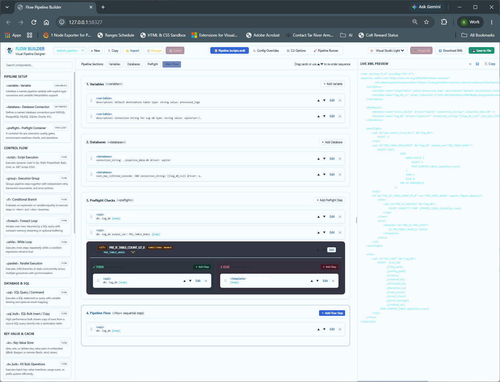

### What It's Doing:
* **Instant Dynamic Theme Switching:** Powered by HTMX and CSS variables without page reloads.
* **Clean Daytime Ergonomics:** Crisp borders, high-contrast typography, and accessible syntax coloring in the Live XML pane.
* **Identical Functional Parity:** Full access to component insertion, drag reordering, and runner telemetry across all visual themes.

---

<!-- Slide 5: Multi-Theme Support (VS Dark) -->
# Theme Customization: Visual Studio Dark
### *Low-Glare Visual Studio Dark Aesthetic*

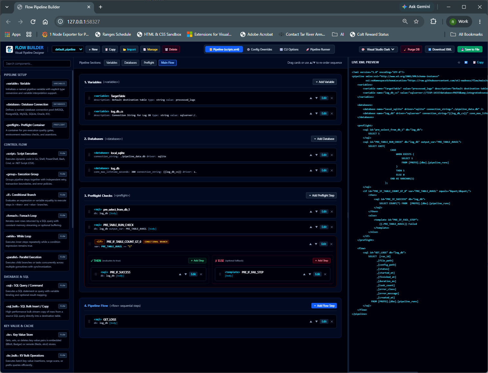

### What It's Doing:
* **Developer-Centric Dark Mode:** Modern dark charcoal surfaces with vibrant neon status indicators (blue, cyan, emerald, amber).
* **Code Editor Aesthetics:** Matches standard VS Code dark styling for data engineers spending extended sessions designing complex ETL pipelines.
* **Syntax-Highlighted Live Code:** Right pane provides clear, syntax-highlighted XML markup reflecting every card modification instantly.

---

<!-- Slide 6: Component Search & Active Pipeline Editing -->
# Component Search & Pipeline Editing
### *Real-Time Filtering & Active Pipeline Context*

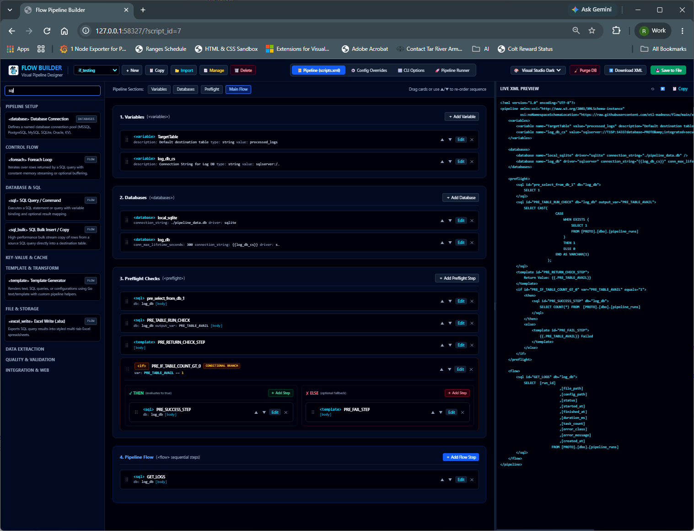

### What It's Doing:
* **Instant Palette Search:** Typing `"sql"` into the component search bar dynamically filters available components down in real time.
* **Pipeline Selector:** Active pipeline `if_testing` loaded from SQLite storage (`flow_builder.db`).
* **Visualizing Complex Control Flow:**
  * Shows a conditional branch card (`<if> PRE_IF_TABLE_COUNT_GT_0`).
  * Condition expression: `var: PRE_TABLE_AVAIL == '1'`.
  * Distinct colored sub-branches:
    * **Green Branch:** `<then>` containing `PRE_SUCCESS_STEP`
    * **Red Branch:** `<else>` containing `PRE_FAIL_STEP` with template fallback `{{.PRE_TABLE_AVAIL}} Failed`.
* **Reordering & Editing:** Every card features drag handles, up/down arrows (`▲` `▼`), in-line `Edit` dialog, and `✕` removal.

---

<!-- Slide 7: Nested Step Insertion Modal -->
# Nested Step Insertion: Dynamic Containers
### *Inserting Primitives Inside Conditional & Loop Blocks*

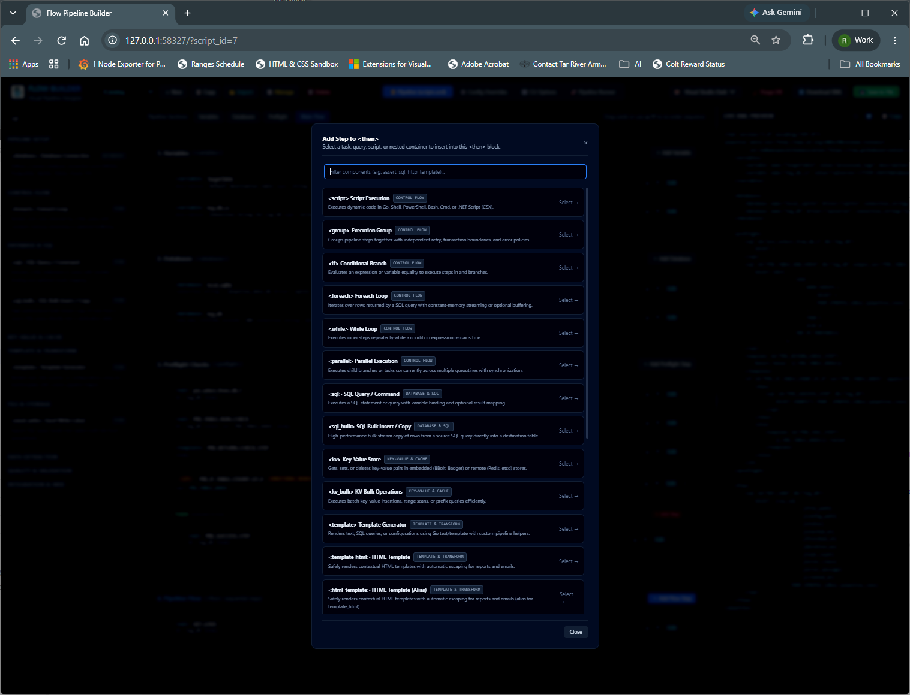

### What It's Doing:
* **Scoped Component Insertion:** The `Add Step to <then>` modal allows targeted insertion of any task directly inside nested branch containers.
* **Searchable Step Catalog:** Instant filter bar (`Filter components (e.g. assert, sql, http, template)...`).
* **Supported Nested Primitives:**
  * `<script>`: Execute embedded Go, Shell, PowerShell, Bash, Cmd, or C# (.NET CSX) code.
  * `<group>`: Nest tasks with independent retry policies, transaction rollback boundaries, and error policies.
  * `<if>`: Multi-level nested conditional logic.
  * `<foreach>` / `<while>`: Iterative streaming data loops over SQL result sets.
  * `<parallel>`: Concurrent multi-goroutine execution with synchronized joins.
  * `<sql>` / `<sql_bulk>`: High-throughput query execution and direct table-to-table stream copying.
  * `<kv>` / `<kv_bulk>`: Key-value operations on embedded BBolt/Badger or external Redis/etcd.
  * `<template>` / `<template_html>`: Contextual template rendering with automatic escaping.

---

<!-- Slide 8: Database Connection Pooling & Secrets -->
# Database Connection Management
### *Native Multi-Engine Dialect Pooling & Secret Interpolation*

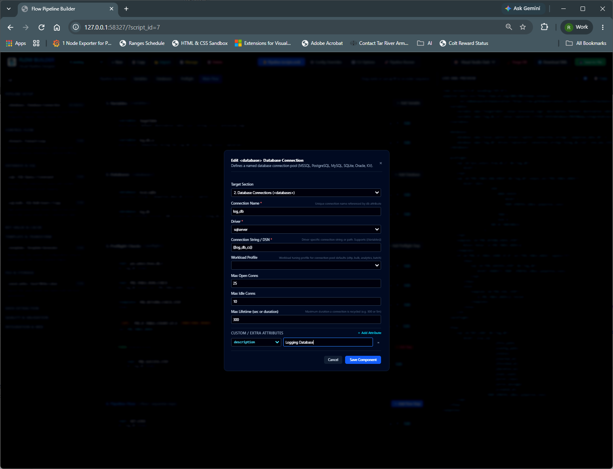

### What It's Doing:
* **Named Connection Definition:** Configures connection pool `log_db` assigned to the `<databases>` section.
* **Cross-Dialect Drivers:** Built-in support for `sqlserver`, `postgres`, `mysql`, `sqlite`, `oracle`, and `kv`.
* **Dynamic Secret Interpolation:**
  * Supports variable expansion syntax `{{log_db_cs}}`.
  * Resolves secrets up to 3 levels deep across base XML, environment overrides (`-config`), and CLI arguments (`-vars`).
  * Protects sensitive production credentials from hardcoded Git commits.
* **Workload Tuning Profiles:** Optimizes connection pooling for `oltp`, `bulk`, `analytics`, or `batch`.
* **Connection Lifecycle Limits:**
  * Max Open Connections (`25`)
  * Max Idle Connections (`10`)
  * Max Lifetime Duration (`300` seconds)
* **Custom Dynamic Attributes:** Expandable key-value pairs (e.g. `description: Logging Database`).

---

<!-- Slide 9: Pipeline Catalog & Script Management -->
# Pipeline Catalog & Storage Management
### *Embedded SQLite Storage for Drafts and Production Scripts*

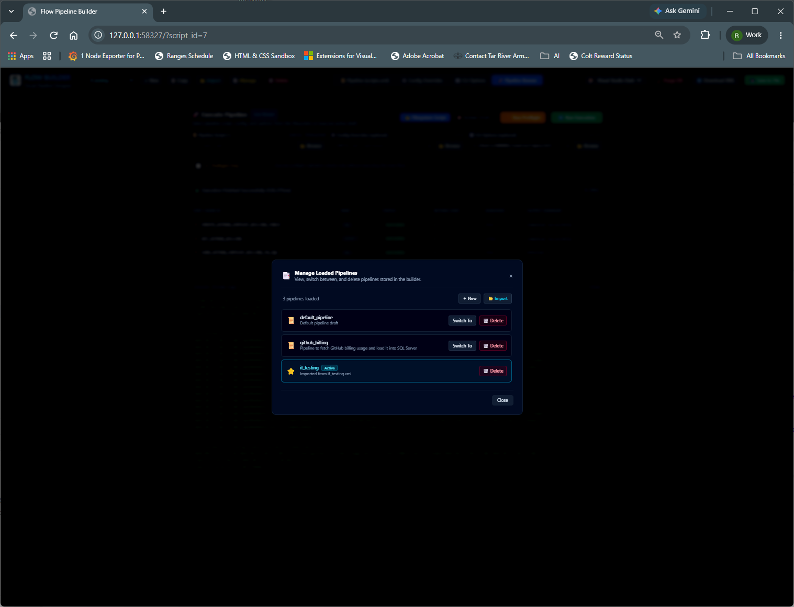

### What It's Doing:
* **Centralized Pipeline Catalog:** The `Manage Loaded Pipelines` modal lists all pipelines stored in the builder's local SQLite database (`flow_builder.db`).
* **Multi-Pipeline Switching:**
  * `default_pipeline`: Default pipeline draft.
  * `github_billing`: Pipeline fetching GitHub billing usage and loading into SQL Server.
  * `if_testing`: Active pipeline imported from `if_testing.xml`.
* **Pipeline Lifecycle Operations:**
  * **`Switch To`:** Instant one-click activation of another pipeline in the visual designer.
  * **`+ New`:** Spin up clean empty pipeline configurations.
  * **`Import`:** Ingest existing XML pipeline files from the local filesystem.
  * **`Delete` / `Purge DB`:** Remove obsolete drafts or reset builder state.

---

<!-- Slide 10: CLI Options File Selector -->
# CLI Options File Navigator
### *Binding Pre-Baked Profiles to Interactive Runs*

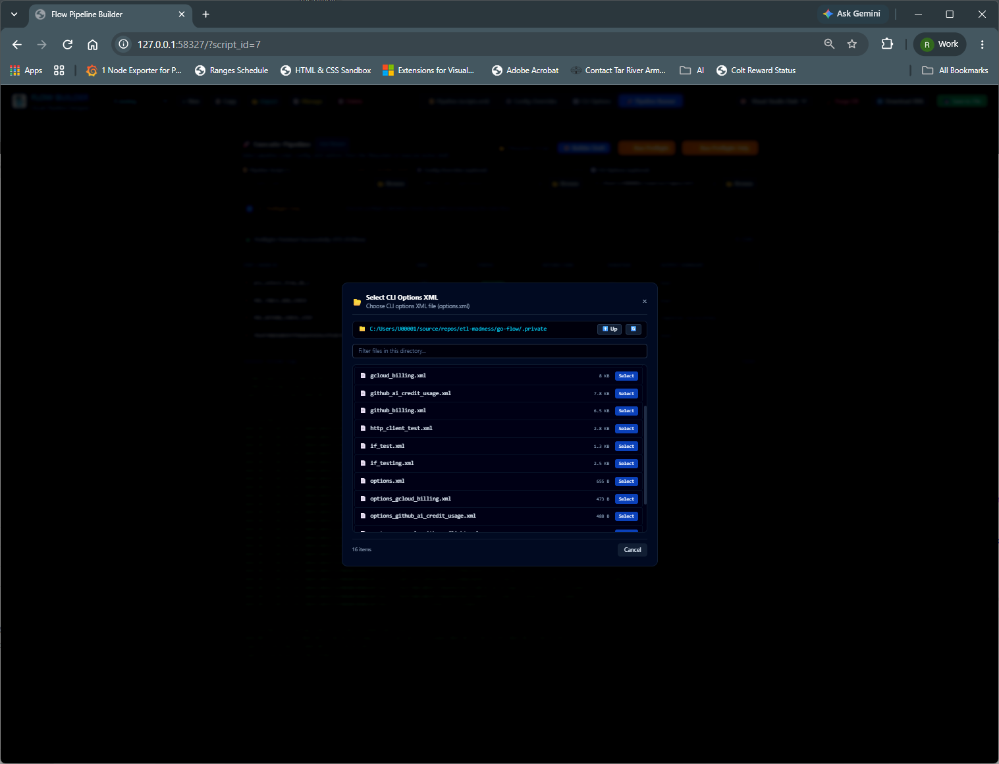

### What It's Doing:
* **Interactive Directory Navigation:** Built-in modal filesystem browser traversing folders (such as `.private/`).
* **Pre-Baked Execution Profiles:**
  * Selects `-options` XML files containing pre-configured flags, runtime variables, and connection overrides.
  * Examples: `options.xml`, `options_gcloud_billing.xml`, `options_github_ai_credit_usage.xml`.
* **Zero CLI Friction:** Eliminates the need to manually memorize or copy lengthy CLI command flags when testing pipelines in the browser.

---

<!-- Slide 11: Live Execution & Telemetry Dashboard -->
# Live Execution & Real-Time Telemetry
### *Interactive Pipeline Runner with Step-by-Step Audit Metrics*

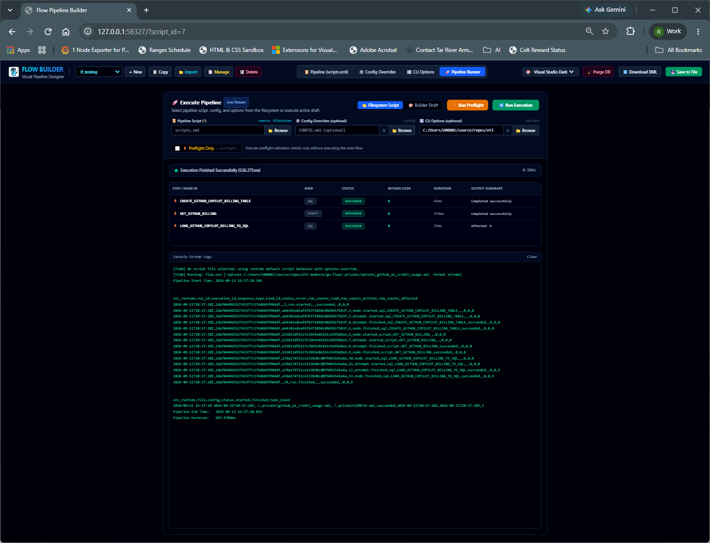

### What It's Doing:
* **Dual Execution Modes:** Select between executing a `Filesystem Script` or the in-memory `Builder Draft`.
* **Configuration Binding:** Combines pipeline script (`scripts.xml`), config overrides (`CONFIG.xml`), and CLI options (`options_github_ai_credit_usage.xml`).
* **Execution Summary Banner:** Immediate execution outcome and benchmark timing: `Execution Finished Successfully (536.275ms)`.
* **Per-Step Execution Grid:**
  | Step / Node ID | Kind | Status | Return Code | Duration | Output Summary |
  | :--- | :--- | :--- | :--- | :--- | :--- |
  | `CREATE_GITHUB_COPILOT_BILLING_TABLE` | SQL | `SUCCEEDED` | `0` | 43ms | Completed successfully |
  | `GET_GITHUB_BILLING` | SCRIPT | `SUCCEEDED` | `0` | 374ms | Completed successfully |
  | `LOAD_GITHUB_COPILOT_BILLING_TO_SQL` | SQL | `SUCCEEDED` | `0` | 33ms | **Affected: 9** |
* **Console Stream Logs:** Emits real-time RFC3339 audit telemetry rows with sequence numbers, run IDs, and accurate row tracking (`rows_read`, `rows_written`, `rows_affected`).

---

<!-- Slide 12: Standalone Preflight Validation Runner -->
# Preflight Validation: Quality Gates
### *Non-Destructive Fail-Fast Environment Testing*

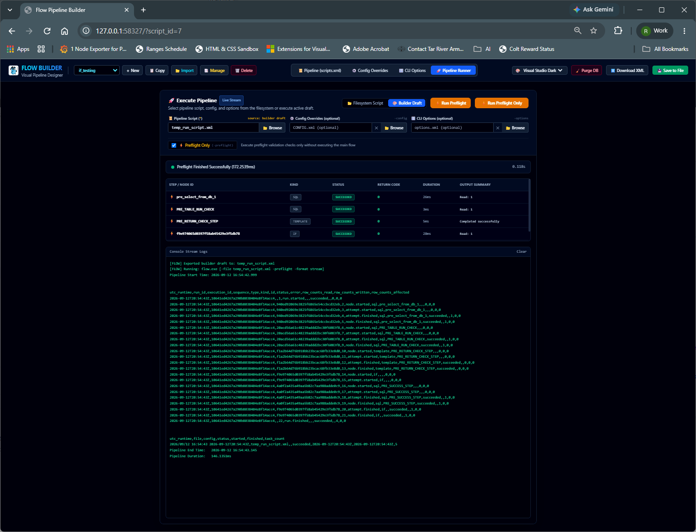

### What It's Doing:
* **Dedicated Preflight Execution (`-preflight`):**
  > *"Execute preflight validation checks only without executing the main flow"*
* **Non-Destructive Guarantee:** `<flow>` data loading nodes are completely bypassed. Only diagnostic checks, database ping tests, and assertions run.
* **Rapid Diagnostic Results (`172.2539ms`):**
  * `pre_select_from_db_1` (SQL, Succeeded, 26ms, Read: 1)
  * `PRE_TABLE_RUN_CHECK` (SQL, Succeeded, 3ms, Read: 1)
  * `PRE_RETURN_CHECK_STEP` (TEMPLATE, Succeeded, 5ms)
  * `f9e974065d0397f58ab45429e3f5db78` (IF conditional branch, Succeeded, 28ms, Read: 1)
* **Fail-Fast Safety:** Catches missing environment variables, unreachable databases, or schema mismatches before executing heavy data transfers.

---

<!-- Slide 13: Options-Driven Preflight & Assertions -->
# Options-Driven Preflight & Assertions
### *Automated Structural Assertions via CLI Profiles*

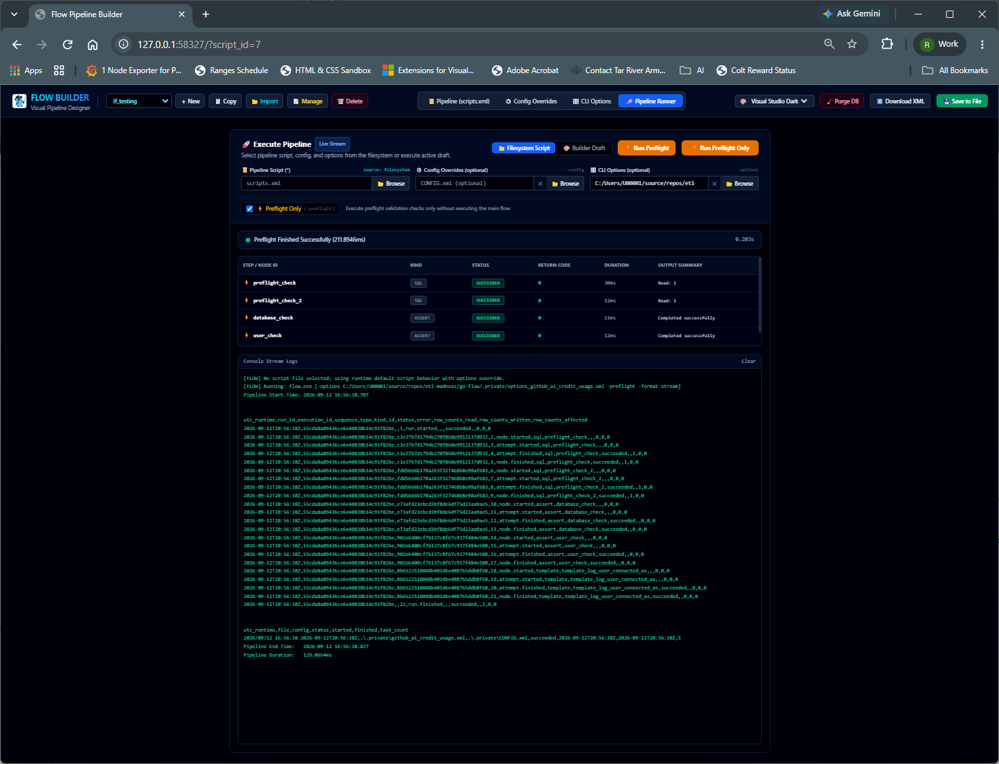

### What It's Doing:
* **Configuration Profile Validation:** Executes preflight checks specified inside `options_github_ai_credit_usage.xml`.
* **Automated `<assert>` Quality Gates:**
  * `preflight_check` (SQL check, 30ms, Read: 1)
  * `preflight_check_2` (SQL check, 12ms, Read: 1)
  * `database_check` (**ASSERT**, 11ms, Completed successfully)
  * `user_check` (**ASSERT**, 12ms, Completed successfully)
* **Production Readiness Sign-off:** Verifies database availability and permission rights in 211ms before scheduled cron jobs or worker nodes take over.

---

<!-- Slide 14: Summary & Quick Reference -->
# Summary & Command Reference
### *Everything You Need to Run Flow and the Visual Builder*


### Key Capabilities Summary:
* **Visual HTMX Studio:** Launch with `flow -builder` on an ephemeral or designated port.
* **Declarative XML Schema:** Full pipeline reproducibility, version control, and CI/CD friendly.
* **Multi-Engine Dialects:** Native translation for SQL Server, Postgres, MySQL, Oracle, and SQLite.
* **Two-Stage Execution:** Standalone `<preflight>` quality gates prevent failed batch runs.
* **Full Compliance Telemetry:** Automatic logging to `pipeline_runs` and `pipeline_events` tables.

### Quick Start Commands:
```bash
# 1. Launch the Visual Builder web interface
flow -builder -builder-port 8080

# 2. Run Preflight quality validation only (non-destructive)
flow -file pipeline.xml -preflight

# 3. Execute full pipeline with pre-baked options profile
flow -file pipeline.xml -options options.xml

# 4. Run pipeline with runtime variable overrides
flow -file pipeline.xml -vars "TargetTable=prod_orders,BatchSize=10000"
```
