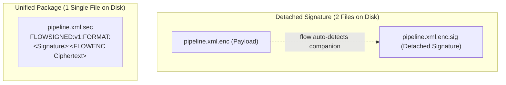
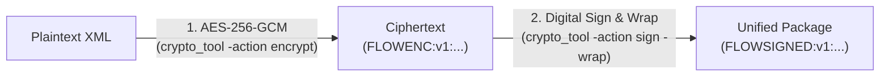
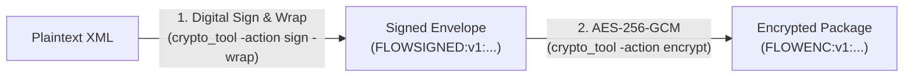

# Single-File Cryptography: Combining Encryption & Digital Signatures

This guide explains how to combine **digital signatures** and **AES-256-GCM encryption** into a **single, unified file** for execution with `flow.exe` / `flow`. It details the cryptographic envelope formats, explains how to avoid common configuration pitfalls (such as detached signature confusion), and provides end-to-end walkthroughs for **Windows (PowerShell / Windows Cert Store)** and **Linux / macOS (OpenSSL / Bash / zsh)**, including generating self-signed certificates with both OpenSSL and `crypto_tool`.

---

## 1. Unified Envelopes vs. Detached Signatures

`go-flow` and its companion tool `crypto_tool` support two distinct distribution models for signed and encrypted pipelines:

| Model | Files on Disk | File Reference in `options.xml` | How Verification Operates |
| :--- | :---: | :--- | :--- |
| **Detached Signature** | **2 Files**<br>`pipeline.xml.enc`<br>`pipeline.xml.enc.sig` | Points to the **payload** (`pipeline.xml.enc`).<br>*Never point to the `.sig` file!* | `flow.exe` auto-discovers `<file>.sig`, verifies the detached signature against the payload, and then decrypts the payload. |
| **Unified Single File**<br>*(Recommended)* | **1 File**<br>`pipeline.xml.sec` | Points directly to the single unified package (`pipeline.xml.sec`). | Both the cryptographic signature and the encrypted payload are packaged together in a single self-contained envelope. |



### The Common Pitfall: Pointing to `.sig` Files Directly

A common mistake when using detached signatures is configuring `options.xml` or `-file` to point directly to the `.sig` file:

```xml
<!-- INCORRECT: Pointing directly to a detached signature file -->
<file>.\deploy\pipeline.xml.enc.sig</file>
<encrypted>true</encrypted>
<secure-key>SecretKey</secure-key>
```

When this happens:
1. `pipeline.xml.enc.sig` contains only an ASCII signature header (e.g. `FLOWSIG:v1:OPENSSL-RSA-SHA256:...`).
2. Because `<encrypted>true</encrypted>` is set, `flow` attempts to decrypt the ASCII signature bytes as if they were AES-256 ciphertext.
3. AES-GCM authentication tag validation fails immediately with:
   ```
   failed to decrypt resource: decryption failed: invalid key or tampered ciphertext
   ```
4. **Resolution**: Point `<file>` to `pipeline.xml.enc` (which lets `flow` auto-detect `pipeline.xml.enc.sig`), or use a **unified single-file envelope** as described below.

---

## 2. The Two Unified Architectures

`go-flow` supports two single-file patterns:

### Architecture A: Encrypt-then-Sign (`FLOWSIGNED:v1:` with `-wrap`) &mdash; Recommended

In this pattern, the plaintext pipeline XML is encrypted first, and the resulting ciphertext is signed and packaged into a self-contained envelope using `crypto_tool -wrap`.



#### Envelope Anatomy:
```text
FLOWSIGNED:v1:<FORMAT>:<base64(DigitalSignature)>:<base64(FLOWENC:v1:Salt:Nonce:Ciphertext:Tag)>
```

#### Why This Is Recommended:
* **Zero Attack Surface:** `flow` validates the digital signature over the ciphertext **first**. Untrusted or tampered payloads are rejected before decryption keys are touched or decrypted data is loaded into memory.
* **Transparent Decryption:** Once the outer signature passes verification, the engine automatically extracts the inner `FLOWENC:v1:` payload and decrypts it using the provided `-key-file`, `-secure-key`, or `FLOW_SECURE_KEY`.

---

### Architecture B: Sign-then-Encrypt (`FLOWENC:v1:` containing `FLOWSIGNED:v1:`)

In this pattern, the plaintext XML is signed into a `FLOWSIGNED:v1:` envelope first, and then the entire signed package is encrypted into an outer `FLOWENC:v1:` payload.



#### Envelope Anatomy:
```text
FLOWENC:v1:<base64(AES-256-GCM-Ciphertext-Enclosing-FLOWSIGNED-Envelope)>
```

#### When to Use:
* **Signer Privacy:** In regulated or multi-tenant environments where the identity of the signer, certificate metadata, and signature algorithms must remain strictly confidential from external observers.
* **Lifecycle:** `flow` decrypts the outer ciphertext first, detects that the inner content is a `FLOWSIGNED:v1:` envelope, and immediately verifies the digital signature before executing the pipeline.

---

## 3. End-to-End Walkthrough: Windows (PowerShell & Certificates)

This walkthrough demonstrates creating and running a **unified single-file pipeline** on Windows using standard PowerShell and an X.509 code signing certificate.

### Prerequisites & Example Setup

Assume the following directory structure:
* `C:\etl\pipelines\` &mdash; Source directory containing raw pipeline definitions.
* `C:\etl\deploy\` &mdash; Production deployment directory.
* `C:\certs\` &mdash; Secure certificate and key storage.

---

### Step 1: Exporting or Generating Certificate & Private Key on Windows

#### Option 1: Export Public Certificate from Windows Certificate Store
```powershell
# Locate your code-signing certificate thumbprint
Get-ChildItem -Path Cert:\CurrentUser\My -CodeSigningCert

# Export the public certificate in X.509 format (.cer)
$cert = Get-Item Cert:\CurrentUser\My\3F4B8C1E0A2D3E4F5A6B7C8D9E0F1A2B3C4D5E6F
Export-Certificate -Cert $cert -FilePath C:\certs\enterprise_code_signer.cer
```

#### Option 2: Export Private Key via PFX & Convert to PEM
If the private key is marked exportable, export the PFX and extract the PEM private key:
```powershell
# Export PFX with a temporary export passphrase
$pwd = ConvertTo-SecureString -String "ExportTempPass123!" -AsPlainText -Force
Export-PfxCertificate -Cert $cert -FilePath C:\certs\enterprise_signer.pfx -Password $pwd

# Extract the private key as standard PEM using OpenSSL
openssl pkcs12 -in C:\certs\enterprise_signer.pfx -nocerts -out C:\certs\enterprise_signer_key.pem -nodes
openssl pkcs12 -in C:\certs\enterprise_signer.pfx -clcerts -nokeys -out C:\certs\enterprise_code_signer.pem
```

#### Option 3: Generate New Keypair & Self-Signed Certificate Directly with `crypto_tool`
If you do not have an existing enterprise certificate authority, generate an RSA keypair and self-signed X.509 certificate directly (no external OpenSSL required):
```powershell
.\crypto_tool.exe -action gen-keypair `
    -keypair-type rsa `
    -bits 4096 `
    -out-priv C:\certs\enterprise_signer_key.pem `
    -out-pub C:\certs\enterprise_signer_pub.pem `
    -out-cert C:\certs\enterprise_code_signer.pem `
    -cn "Enterprise ETL Pipeline Signer"
```

---

### Step 2: Encrypt the Plaintext Pipeline

Given a plaintext pipeline `C:\etl\pipelines\daily_sales_etl.xml`, encrypt it using AES-256-GCM. 

> [!TIP]
> To prevent secrets from appearing in process listings, supply the encryption passphrase via `-key-file` or the `FLOW_SECURE_KEY` environment variable.

```powershell
# Store key securely in a key file
Set-Content -Path C:\certs\encryption.key -Value "EnterpriseSecretPassphrase2026!" -NoNewline

# Encrypt pipeline to text-armored ciphertext
.\crypto_tool.exe -action encrypt `
    -in C:\etl\pipelines\daily_sales_etl.xml `
    -out C:\etl\deploy\daily_sales_etl.enc `
    -key-file C:\certs\encryption.key
```

---

### Step 3: Sign and Wrap into a Single Unified File

Sign the encrypted file with your code signing certificate and include the `-wrap` flag:

```powershell
.\crypto_tool.exe -action sign `
    -in C:\etl\deploy\daily_sales_etl.enc `
    -out C:\etl\deploy\daily_sales_etl_unified.sec `
    -private-key C:\certs\enterprise_signer_key.pem `
    -cert C:\certs\enterprise_code_signer.pem `
    -sig-type openssl `
    -wrap
```

*Output:*
```text
Successfully signed C:\etl\deploy\daily_sales_etl.enc -> C:\etl\deploy\daily_sales_etl_unified.sec (format: OPENSSL-RSA-SHA256)
```

The resulting file `daily_sales_etl_unified.sec` is a **single text-armored file** containing both the digital signature and the encrypted payload. No separate `.sig` file is generated or needed.

---

### Step 4: Configure `options.xml` for Unified Single-File Execution

Create your execution options file (`C:\etl\options\daily_sales_options.xml`):

```xml
<flow_cli_options xmlns:xsi="http://www.w3.org/2001/XMLSchema-instance"
    xsi:noNamespaceSchemaLocation="https://raw.githubusercontent.com/etl-madness/go-flow/main/xsd/options.xsd">
    <options>
        <!-- Single unified file containing signature + encrypted payload -->
        <file>C:\etl\deploy\daily_sales_etl_unified.sec</file>
        <format>stream</format>

        <!-- Security flags -->
        <verify-signature>true</verify-signature>
        <encrypted>true</encrypted>

        <!-- Verification certificate (X.509 .cer or .pem) -->
        <cert>C:\certs\enterprise_code_signer.pem</cert>

        <!-- Decryption key file (avoids storing passwords in XML) -->
        <key-file>C:\certs\encryption.key</key-file>
    </options>
</flow_cli_options>
```

> [!NOTE]
> `<cert>` supports both PEM certificates (`.pem`, `.crt`) and raw Windows binary DER certificates (`.cer`).

If your signing certificate was issued by an internal Enterprise Root CA, you can also supply `<ca-cert>` to validate the complete chain of trust:

```xml
<ca-cert>C:\certs\enterprise_root_ca.cer</ca-cert>
```

---

### Step 5: Execute the Pipeline on Windows with `flow.exe`

Execute the pipeline using either the options file or direct CLI flags:

#### Method A: Using `options.xml`
```powershell
.\flow.exe -options C:\etl\options\daily_sales_options.xml
```

#### Method B: Using Direct Command Line Flags
```powershell
.\flow.exe `
    -file C:\etl\deploy\daily_sales_etl_unified.sec `
    -cert C:\certs\enterprise_code_signer.pem `
    -key-file C:\certs\encryption.key `
    -verify-signature `
    -encrypted `
    -format stream
```

---

## 4. End-to-End Walkthrough: Linux & macOS (Bash / zsh)

This walkthrough demonstrates creating self-signed certificates, signing, encrypting, and running a **unified single-file pipeline** on **Linux** (Ubuntu, Debian, RHEL, Alpine) and **macOS**.

### Prerequisites & Example Setup

Assume standard POSIX production paths:
* `/opt/etl/pipelines/` &mdash; Source directory containing raw pipeline definitions.
* `/opt/etl/deploy/` &mdash; Production deployment directory.
* `/etc/ssl/flow/` (or `~/.certs/`) &mdash; Restricted certificate and key storage.

```bash
mkdir -p /opt/etl/pipelines /opt/etl/deploy /opt/etl/options /etc/ssl/flow
chmod 700 /etc/ssl/flow
```

---

### Step 1: Create a Self-Signed Certificate & Keypair

You can generate your self-signed code-signing certificate using standard OpenSSL or directly with `crypto_tool`.

#### Option A: Using OpenSSL (Standard on Linux & macOS)

Generate a 4096-bit RSA private key and self-signed X.509 certificate in a single command:

```bash
# Generate private key and self-signed certificate (valid for 365 days)
openssl req -x509 -newkey rsa:4096 \
    -keyout /etc/ssl/flow/flow_signer_key.pem \
    -out /etc/ssl/flow/flow_signer_cert.pem \
    -days 365 \
    -nodes \
    -subj "/C=US/ST=California/L=San Francisco/O=Enterprise ETL/CN=Flow Pipeline Signer"

# Restrict private key permissions (owner read-only)
chmod 600 /etc/ssl/flow/flow_signer_key.pem
chmod 644 /etc/ssl/flow/flow_signer_cert.pem
```

*For modern Elliptic Curve (ECDSA P-256) instead of RSA:*
```bash
openssl req -x509 -newkey ec -pkeyopt ec_paramgen_curve:prime256v1 \
    -keyout /etc/ssl/flow/flow_ecdsa_key.pem \
    -out /etc/ssl/flow/flow_ecdsa_cert.pem \
    -days 365 \
    -nodes \
    -subj "/CN=Flow ECDSA Pipeline Signer"

chmod 600 /etc/ssl/flow/flow_ecdsa_key.pem
```

#### Option B: Using `crypto_tool` Directly (Pure Go &mdash; Zero External Dependencies)

If OpenSSL is not installed (e.g. minimal Docker containers, Alpine Linux, or lightweight VMs), use `crypto_tool`'s built-in `gen-keypair` action:

```bash
# Generate 4096-bit RSA keypair and self-signed X.509 certificate
./crypto_tool -action gen-keypair \
    -keypair-type rsa \
    -bits 4096 \
    -out-priv /etc/ssl/flow/flow_signer_key.pem \
    -out-pub /etc/ssl/flow/flow_signer_pub.pem \
    -out-cert /etc/ssl/flow/flow_signer_cert.pem \
    -cn "Flow Pipeline Signer"

# Secure permissions
chmod 600 /etc/ssl/flow/flow_signer_key.pem
chmod 644 /etc/ssl/flow/flow_signer_cert.pem /etc/ssl/flow/flow_signer_pub.pem
```

*Output:*
```text
Successfully generated rsa keypair:
  Private key: /etc/ssl/flow/flow_signer_key.pem
  Public key:  /etc/ssl/flow/flow_signer_pub.pem
  Certificate: /etc/ssl/flow/flow_signer_cert.pem
```

---

### Step 2: Create a Secure Symmetric Encryption Key File

Store your AES-256 encryption passphrase in a dedicated key file with restricted POSIX permissions (`0600`) so it cannot be read by other system users:

```bash
# Create key file with restricted permissions
echo -n "EnterpriseSecretPassphrase2026!" > /etc/ssl/flow/encryption.key
chmod 600 /etc/ssl/flow/encryption.key
```

---

### Step 3: Encrypt the Pipeline (AES-256-GCM)

Encrypt the raw pipeline definition `/opt/etl/pipelines/daily_sales_etl.xml`:

```bash
./crypto_tool -action encrypt \
    -in /opt/etl/pipelines/daily_sales_etl.xml \
    -out /opt/etl/deploy/daily_sales_etl.enc \
    -key-file /etc/ssl/flow/encryption.key
```

---

### Step 4: Sign and Wrap into a Unified File (`.sec`)

Digitally sign the encrypted ciphertext using your private key and wrap it into a single `FLOWSIGNED:v1:...` envelope:

```bash
./crypto_tool -action sign \
    -in /opt/etl/deploy/daily_sales_etl.enc \
    -out /opt/etl/deploy/daily_sales_etl_unified.sec \
    -priv /etc/ssl/flow/flow_signer_key.pem \
    -cert /etc/ssl/flow/flow_signer_cert.pem \
    -sig-type openssl \
    -wrap
```

*Output:*
```text
Successfully signed /opt/etl/deploy/daily_sales_etl.enc -> /opt/etl/deploy/daily_sales_etl_unified.sec (format: OPENSSL-RSA-SHA256)
```

#### Streamlined Alternative: Single-Line Unix Pipe (Zero Intermediate Files)
Because `crypto_tool` supports standard input/output (`-in -` and `-out -`), you can encrypt and sign in a single command pipeline without writing `daily_sales_etl.enc` to disk:

```bash
./crypto_tool -action encrypt -in /opt/etl/pipelines/daily_sales_etl.xml -key-file /etc/ssl/flow/encryption.key -out - | \
./crypto_tool -action sign -in - -priv /etc/ssl/flow/flow_signer_key.pem -cert /etc/ssl/flow/flow_signer_cert.pem -wrap -out /opt/etl/deploy/daily_sales_etl_unified.sec
```

---

### Step 5: Verify the Unified File Manually (Optional)

Verify that the unified `.sec` file passes cryptographic validation against the self-signed certificate:

```bash
./crypto_tool -action verify \
    -in /opt/etl/deploy/daily_sales_etl_unified.sec \
    -cert /etc/ssl/flow/flow_signer_cert.pem
```

*Output:*
```text
Signature VALID (OPENSSL via RSA-SHA256, Signer: Flow Pipeline Signer)
```

---

### Step 6: Execute on Linux / macOS with `flow`

#### Method A: Using Command Line Flags
```bash
./flow \
    -file /opt/etl/deploy/daily_sales_etl_unified.sec \
    -cert /etc/ssl/flow/flow_signer_cert.pem \
    -key-file /etc/ssl/flow/encryption.key \
    -verify-signature \
    -encrypted \
    -format stream
```

#### Method B: Using Options File (`/opt/etl/options/daily_sales_options.xml`)
```xml
<flow_cli_options xmlns:xsi="http://www.w3.org/2001/XMLSchema-instance"
    xsi:noNamespaceSchemaLocation="https://raw.githubusercontent.com/etl-madness/go-flow/main/xsd/options.xsd">
    <options>
        <file>/opt/etl/deploy/daily_sales_etl_unified.sec</file>
        <format>stream</format>
        <verify-signature>true</verify-signature>
        <encrypted>true</encrypted>
        <cert>/etc/ssl/flow/flow_signer_cert.pem</cert>
        <key-file>/etc/ssl/flow/encryption.key</key-file>
    </options>
</flow_cli_options>
```

```bash
./flow -options /opt/etl/options/daily_sales_options.xml
```

---

## 5. Execution Lifecycle & Verification Output

When `flow` executes a unified package, it performs verification and decryption in sequential order:

```text
[FLOW] Verifying digital signature on resource "daily_sales_etl_unified.sec"...
[FLOW] Signature verified successfully. Signer: "Flow Pipeline Signer" (Algorithm: OPENSSL-RSA-SHA256).
[FLOW] Decrypting AES-256-GCM payload using provided security key...
[FLOW] Decryption successful.
[FLOW] Parsing pipeline XML schema and abstract syntax tree...
[FLOW] Pipeline initialized: "daily_sales_pipeline". Executing nodes...
```

If any tampering occurs:
* **Altered Ciphertext or Signature:** 
  ```text
  Error reading script file: digital signature verification failed for resource "...daily_sales_etl_unified.sec": RSA signature verification failed
  ```
* **Tampered Certificate or Untrusted Signer:**
  ```text
  Error reading script file: certificate verification failed: certificate signed by unknown authority
  ```
* **Tampered Payload inside Decryption Stage:**
  ```text
  Error reading script file: decryption failed: invalid key or tampered ciphertext
  ```

---

## 6. Summary Cheat Sheet (Windows, Linux, macOS)

| Task | Windows (PowerShell) | Linux / macOS (Bash / zsh) |
| :--- | :--- | :--- |
| **Create Self-Signed Certificate (OpenSSL)** | `openssl req -x509 -newkey rsa:4096 -keyout key.pem -out cert.pem -days 365 -nodes -subj "/CN=Signer"` | `openssl req -x509 -newkey rsa:4096 -keyout key.pem -out cert.pem -days 365 -nodes -subj "/CN=Signer"` |
| **Create Self-Signed Certificate (`crypto_tool`)** | `.\crypto_tool.exe -action gen-keypair -bits 4096 -out-priv key.pem -out-cert cert.pem -cn "Signer"` | `./crypto_tool -action gen-keypair -bits 4096 -out-priv key.pem -out-cert cert.pem -cn "Signer"` |
| **Create Secure Key File** | `Set-Content -Path secret.key -Value "Passphrase" -NoNewline` | `echo -n "Passphrase" > secret.key && chmod 600 secret.key` |
| **1. Encrypt XML** | `.\crypto_tool.exe -action encrypt -in job.xml -out job.enc -key-file secret.key` | `./crypto_tool -action encrypt -in job.xml -out job.enc -key-file secret.key` |
| **2. Sign & Wrap (Single File)** | `.\crypto_tool.exe -action sign -in job.enc -out job.sec -priv key.pem -cert cert.pem -wrap` | `./crypto_tool -action sign -in job.enc -out job.sec -priv key.pem -cert cert.pem -wrap` |
| **3. Streamlined Piped Single-Step** | `.\crypto_tool.exe -action encrypt -in job.xml -key-file secret.key -out - \| .\crypto_tool.exe -action sign -in - -priv key.pem -cert cert.pem -wrap -out job.sec` | `./crypto_tool -action encrypt -in job.xml -key-file secret.key -out - \| ./crypto_tool -action sign -in - -priv key.pem -cert cert.pem -wrap -out job.sec` |
| **4. Verify Manually** | `.\crypto_tool.exe -action verify -in job.sec -cert cert.pem` | `./crypto_tool -action verify -in job.sec -cert cert.pem` |
| **5. Run Single File with Flow** | `.\flow.exe -file job.sec -cert cert.pem -key-file secret.key -verify-signature -encrypted` | `./flow -file job.sec -cert cert.pem -key-file secret.key -verify-signature -encrypted` |
| **6. Run via Options File** | `.\flow.exe -options options.xml` | `./flow -options options.xml` |
