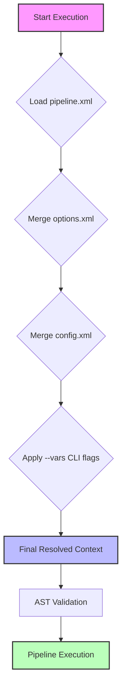

# Configuration & Execution Hierarchy

`go-flow` uses a hierarchical configuration model to separate pipeline logic from environment-specific settings. This allows you to maintain a single pipeline definition while deploying it across different environments (Dev, Staging, Prod) simply by swapping configuration files or CLI arguments.

## Configuration Hierarchy

The engine merges settings in a specific order of precedence. Later stages override earlier ones:

**Base XML (`--file`)** $\rightarrow$ **Options XML (`--options`)** $\rightarrow$ **Config XML (`--config`)** $\rightarrow$ **CLI Variables (`--vars`)**

### Precedence Table

| Level | Source | Purpose | Precedence | Example |
| :--- | :--- | :--- | :--- | :--- |
| **1. Pipeline** | `--file` | Core logic, node definitions, default variables. | Lowest | `scripts.xml` |
| **2. Options** | `--options` | Default CLI flag behavior (ports, formats). | Low | `defaults.xml` |
| **3. Config** | `--config` | Env-specific overrides (DB strings, API keys). | High | `prod_env.xml` |
| **4. Runtime** | `--vars` | Immediate, one-off overrides for a specific run. | Highest | `--vars "Limit=10"` |

### Execution Flow Diagram




---

## Practical Examples

Assume we have a core pipeline file `main.xml` that defines a variable `BatchSize` and a database connection `PrimaryDB`.

### 1. Default Execution (Developer Mode)
Runs using only the defaults defined in the script file.
```bash
./flow.exe --file main.xml
```
*   **BatchSize**: 500 (from `main.xml`)
*   **DB**: `localhost` (from `main.xml`)

### 2. Environment-Based Execution (Production)
Overrides the base settings with a production configuration file.
```bash
./flow.exe --file main.xml --config prod_config.xml
```
*   **BatchSize**: 5000 (overridden by `prod_config.xml`)
*   **DB**: `prod-sql-server.internal` (overridden by `prod_config.xml`)

### 3. Ad-hoc Debugging Execution
Uses the production config but overrides a specific variable via CLI for a quick test.
```bash
./flow.exe --file main.xml --config prod_config.xml --vars "BatchSize=10,DebugMode=true"
```
*   **BatchSize**: 10 (overridden by `--vars`)
*   **DB**: `prod-sql-server.internal` (from `prod_config.xml`)
*   **DebugMode**: true (added via `--vars`)

### 4. Standardized Runner (Using Options File)
Uses an options file to standardize the output format, port, and even the default config file used across all team members.

**Example `corporate_defaults.xml`:**
```xml
<flow_cli_options>
    <option name="format" value="jsonpretty" />
    <option name="builder-port" value="9000" />
    <option name="config" value="dev_config.xml" />
</flow_cli_options>
```

**Execution:**
```bash
./flow.exe --file main.xml --options corporate_defaults.xml
```
*   **Format**: `jsonpretty` (from `corporate_defaults.xml`)
*   **Port**: `9000` (from `corporate_defaults.xml`)
*   **Config**: `dev_config.xml` (automatically loaded because it's specified in the options file)
*   **DB**: `dev-db.local` (loaded via the config file specified in the options)

**Override Example:**
If you want to use the corporate defaults but target Production instead:
```bash
./flow.exe --file main.xml --options corporate_defaults.xml --config prod_config.xml
```
*   **Config**: `prod_config.xml` (CLI flag `--config` overrides the value inside `corporate_defaults.xml`)


---

## Summary of File Roles

- **`scripts.xml`**: The "Source Code". Defines *what* happens.
- **`options.xml`**: The "Tool Settings". Defines *how* the CLI behaves.
- **`config.xml`**: The "Environment". Defines *where* the data is.
- **`--vars`**: The "Tweak". Defines *specifics* for this exact run.
