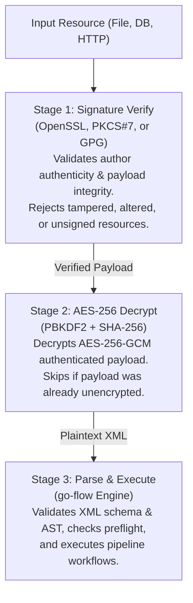

# Cross-Platform Digital Signatures Guide

`go-flow` and its companion utility `crypto_tool` provide pure Go, zero-dependency digital signature creation and verification. This architecture ensures complete cross-platform parity across **Windows**, **Linux**, **macOS**, and **FreeBSD** without requiring OpenSSL, GPG, or Windows CryptoAPI / PowerShell binaries to be installed on target systems.

---

## 1. Supported Signature Standards

| Standard | Algorithms & Key Types | Formats | Verification Compatibility |
| :--- | :--- | :--- | :--- |
| **OpenSSL / PKI X.509** | RSA (2048/4096-bit PKCS#1v1.5 & PSS), ECDSA (P-256, P-384, P-521), Ed25519 | PEM Private/Public Keys, X.509 Certificates (`.pem`, `.crt`, `.cer`) | Cross-platform |
| **PKCS#7 / CMS** | RSA, ECDSA (RFC 2315 / RFC 5652 SignedData) | Detached CMS / PKCS#7 (`.p7s`), PEM or DER format | Cross-platform (pure Go ASN.1 parser) |
| **GPG / OpenPGP** | RSA, Ed25519 (RFC 4880 OpenPGP) | ASCII-armored detached signatures (`.asc`, `.sig`), Armored Keyrings | Cross-platform (pure Go via `gopenpgp/v2`) |

---

## 2. Envelope Formats

To safely store signatures alongside XML pipelines or in SQL databases without binary corruption or character encoding issues, `go-flow` supports both detached signatures and self-contained armored envelopes:

### Detached Armor Envelope (`FLOWSIG:v1:`)
Used when storing signatures as plain text:
```text
FLOWSIG:v1:OPENSSL-RSA-SHA256:<base64-signature>
```
Or for Windows PKCS#7 / GPG:
```text
FLOWSIG:v1:PKCS7:<base64-pkcs7-der>
FLOWSIG:v1:PGP:<base64-pgp-sig>
```

### Unified Signed Package (`FLOWSIGNED:v1:`)
Bundles both the cryptographic signature and the raw payload (XML or ciphertext) into a single text block:
```text
FLOWSIGNED:v1:<FORMAT>:<base64-signature>:<base64-content>
```
When `go-flow` encounters a `FLOWSIGNED:v1:` payload, it automatically extracts and validates the signature against the specified public key or certificate before passing the content to decryption or execution.

---

## 3. Decoupled Pipeline Lifecycle

`go-flow` executes a strict three-stage security pipeline:



Both **Sign-then-Encrypt** and **Encrypt-then-Sign** workflows are supported transparently.

---

## 4. Key & Certificate Generation (`crypto_tool`)

The `crypto_tool` utility can generate asymmetric keypairs and self-signed X.509 code-signing certificates out of the box.

### Generate RSA 2048-bit Keypair & X.509 Certificate
```bash
# Generates private_key.pem, public_key.pem, and cert.pem
./crypto_tool -action gen-keypair -keypair-type rsa -bits 2048 -out-priv priv.pem -out-pub pub.pem -out-cert cert.pem -cn "Production Flow Signer"
```

### Generate ECDSA (P-256) Keypair
```bash
./crypto_tool -action gen-keypair -keypair-type ecdsa -out-priv ec_priv.pem -out-pub ec_pub.pem
```

### Generate Ed25519 Keypair
```bash
./crypto_tool -action gen-keypair -keypair-type ed25519 -out-priv ed_priv.pem -out-pub ed_pub.pem
```

### Generate OpenPGP / GPG Armored Keypair
```bash
./crypto_tool -action gen-keypair -keypair-type pgp -out-priv gpg_priv.asc -out-pub gpg_pub.asc -cn "Release Operator"
```

---

## 5. Signing Pipelines (`crypto_tool`)

### A. OpenSSL Detached Signature
```bash
./crypto_tool -action sign \
  -in pipeline.xml \
  -out pipeline.xml.sig \
  -private-key priv.pem \
  -sig-type openssl
```

### B. PKCS#7 / CMS Detached Signature (`.p7s`)
Creates an RFC 2315 / RFC 5652 PKCS#7 SignedData structure embedding the X.509 signer certificate:
```bash
./crypto_tool -action sign \
  -in pipeline.xml \
  -out pipeline.xml.p7s \
  -private-key priv.pem \
  -cert cert.pem \
  -sig-type pkcs7
```

### C. OpenPGP / GPG ASCII-Armored Signature (`.asc`)
```bash
./crypto_tool -action sign \
  -in pipeline.xml \
  -out pipeline.xml.asc \
  -private-key gpg_priv.asc \
  -sig-type pgp
```

### D. Self-Contained Signed Package (`-wrap`)
Embeds signature and content into a single file suitable for database storage or direct distribution:
```bash
./crypto_tool -action sign \
  -in pipeline.xml \
  -out pipeline.xml.signed \
  -private-key priv.pem \
  -sig-type openssl \
  -wrap
```

---

## 6. Verifying Signatures (`crypto_tool`)

### Verify Detached Signature
```bash
./crypto_tool -action verify \
  -in pipeline.xml \
  -signature pipeline.xml.sig \
  -public-key pub.pem
```
*(If `-signature` is omitted, `crypto_tool` automatically searches for companion files `<in>.sig`, `<in>.asc`, or `<in>.p7s`)*.

### Verify PKCS#7 / CMS Signature
```bash
./crypto_tool -action verify \
  -in pipeline.xml \
  -signature pipeline.xml.p7s \
  -cert cert.pem
```
*(Note: To prevent untrusted/self-signed certificates embedded inside `.p7s` payloads from being blindly accepted, PKCS#7 verification enforces that an explicit trust anchor is supplied via `-cert` or `-ca-cert`)*.

### Verify OpenPGP Armored Signature
```bash
./crypto_tool -action verify \
  -in pipeline.xml \
  -signature pipeline.xml.asc \
  -keyring gpg_pub.asc
```

### Verify and Extract Content from Unified Envelope
```bash
./crypto_tool -action verify \
  -in pipeline.xml.signed \
  -public-key pub.pem \
  -out verified_pipeline.xml
```

---

## 7. Engine Execution with `flow.exe`

### Command Line Flags

| Flag | Description |
| :--- | :--- |
| `-verify-signature` | Enforces signature verification prior to execution or decryption |
| `-public-key <file>` | PEM public key path (RSA, ECDSA, Ed25519) |
| `-cert <file>` | X.509 certificate path (PEM or DER) |
| `-ca-cert <file>` | Root CA certificate for certificate chain validation |
| `-keyring <file>` | OpenPGP public keyring path |
| `-signature <file>` | Explicit detached signature file path |

### Examples

#### 1. Execute Pipeline with Companion Signature
When `pipeline.xml.sig`, `pipeline.xml.asc`, or `pipeline.xml.p7s` exists alongside `pipeline.xml`, `flow.exe` detects and verifies it automatically:
```bash
flow.exe -file pipeline.xml -public-key pub.pem
```

#### 2. Execute Combined Signed and Encrypted Database Pipeline
Verifies the digital signature on the encrypted package, decrypts with AES-256-GCM, and runs the workflow:
```bash
flow.exe \
  -file "sql://sqlserver@localhost:1433?database=ETLFlow#SELECT PipelineXML FROM dbo.flow_pipeline_content WHERE Name='ProductionBilling'" \
  -verify-signature \
  -public-key /etc/flow/signer_pub.pem \
  -encrypted \
  -secure-key "ProductionPassphrase2026"
```

#### 3. Enforce Signatures via XML Options File (`options.xml`)
Options files can enforce signature checks across automated pipelines:
```xml
<?xml version="1.0" encoding="UTF-8"?>
<flow_cli_options>
    <options>
        <verify-signature>true</verify-signature>
        <public-key>/etc/flow/signer_pub.pem</public-key>
        <encrypted>true</encrypted>
        <secure-key>ProductionPassphrase2026</secure-key>
    </options>
</flow_cli_options>
```

Execute using:
```bash
flow.exe -options options.xml -file pipeline.xml.signed
```

---

## 8. Cross-Platform Parity

All signature features are implemented in standard Go and actively maintained libraries:
- `crypto/rsa`, `crypto/ecdsa`, `crypto/ed25519`, `crypto/x509`
- `github.com/ProtonMail/gopenpgp/v2` (modern OpenPGP support)
- `encoding/asn1`, `encoding/pem`

No OS-specific tools (`openssl`, `gpg`, `signtool.exe`, or `certutil`) are invoked at runtime. Binaries compiled for Windows, Linux, macOS, or FreeBSD can seamlessly verify signatures generated on any other operating system.
