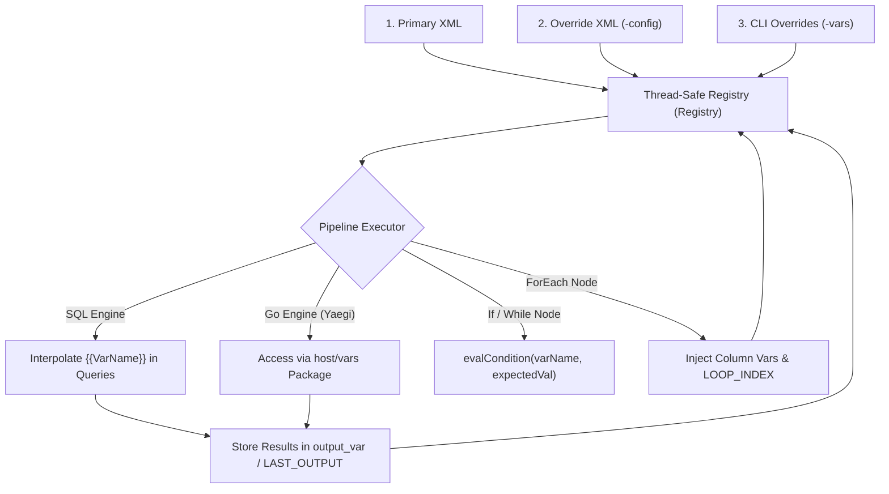

# Flow Variable System (`README_VARIABLES.md`)

The `flow` pipeline engine uses a thread-safe registry (`Registry`) to manage environment variables, system runtime variables, and script state. Variables are evaluated dynamically at runtime and can be interpolated into SQL queries, evaluated in conditional control structures, or accessed programmatically in Go scripts.

## Variable Hierarchy and Precedence

Variables are resolved in a specific hierarchy. When variables share the same key name, higher precedence sources override lower precedence values.

| Precedence | Source | Description |
| :--- | :--- | :--- |
| **1 (Highest)** | **Runtime System Variables** | Set dynamically during loop iterations (`LOOP_INDEX`, `WHILE_INDEX`, column outputs) or script execution (`LAST_OUTPUT`, `output_var`). |
| **2** | **CLI Flag Overrides** | Key-value pairs supplied via the `-vars` command-line flag (`-vars "Threshold=500,TargetTable=logs"`). |
| **3** | **Config Override File** | Variable declarations loaded from an external config file via the `-config` flag. |
| **4 (Lowest)** | **Base XML `<variables>`** | Default variable declarations defined inside the primary pipeline XML configuration. |

---

## Variable Flow Architecture



---

## Usage in Control Structures

### 1. Script Node (`<script>`)
Variables can be written to using `output_var` or read dynamically using the `var` attribute to fetch script code stored within a variable.

```xml
<pipeline>
    <variables>
        <variable name="DynamicQuery" value="SELECT name, email FROM users WHERE active = 1;" />
    </variables>
    <scripts>
        <!-- Reads code directly from the variable 'DynamicQuery' -->
        <script id="RunDynamicQuery" language="sql" db="my_db" var="DynamicQuery" output_var="QueryResult" />
    </scripts>
</pipeline>
```

### 2. ForEach Loop (`<foreach>`)
The `<foreach>` block is a powerful structure that bridges SQL query results with iterative execution logic. When building loops, variables can be used in three distinct ways: dynamically overriding the query, filtering the query, and passing active row data to child scripts.

#### A. Overriding the Driver Query (`var` Attribute)
The `var="dept_id"` attribute does **not** map returned column names. Instead, it instructs the executor to check the registry for a variable named `dept_id`. If `dept_id` exists and contains dynamic SQL code, the executor uses that string as the driver query. If it is undefined or empty, it falls back to the inline query block.

#### B. Passing Variables into the Driver Query
You can filter or configure the driver query by interpolating variables previously populated by a `<script>` or defined globally using standard `{{VariableName}}` placeholders.

#### C. Automatic Column Mapping (`{{column_name}}`)
During execution, the driver SQL query retrieves a set of columns (e.g., `department_id`, `department_name`). On each row iteration, the executor scans the returned row and automatically registers each column's value into the registry under exact, lowercase, and uppercase names. Inside child scripts, these columns are accessible via `{{department_id}}` alongside the zero-based `{{LOOP_INDEX}}`.

#### Comprehensive Example
```xml
<!-- Step 1: Capture a value into a variable from a script -->
<script id="GetActiveStatus" language="sql" db="main_db" output_var="ActiveFlag">
    SELECT 1; -- Assuming this returns '1'
</script>

<!-- Step 2: Use the variable to filter the loop's driver query -->
<!-- Note: var="DynamicDriver" would override the SELECT entirely if defined, but here we assume it's empty -->
<foreach id="IterateDepartments" db="main_db" var="DynamicDriver">
    SELECT department_id, department_name FROM departments WHERE active = {{ActiveFlag}};

    <!-- Step 3: Access automatically mapped row column variables {{department_id}} and {{LOOP_INDEX}} -->
    <script id="ProcessDept" language="sql" db="main_db">
        UPDATE department_stats 
        SET process_order = {{LOOP_INDEX}} 
        WHERE id = {{department_id}};
    </script>
</foreach>
```

### 3. Conditional Branching (`<if>`, `<then>`, `<else>`)
Evaluates conditions using variable states. The condition supports implicit truthiness checks, equality (`equals`), or explicit operators (`==`, `!=`).

```xml
<if var="ENVIRONMENT" equals="PRODUCTION">
    <then>
        <script id="ProdTask" language="sql" db="prod_db">
            UPDATE settings SET maintenance_mode = 0;
        </script>
    </then>
    <else>
        <script id="DevTask" language="sql" db="dev_db">
            UPDATE settings SET debug_mode = 1;
        </script>
    </else>
</if>
```

### 4. Query Filtering (`WHERE` Clause)
SQL statements accept variable values directly inside query filters or streaming targets using `{{VariableName}}` syntax.

```xml
<script id="FilterOrders" language="sql" db="sales_db">
    SELECT order_id, total_amount 
    FROM orders 
    WHERE status = '{{OrderStatus}}' 
      AND created_at >= '{{MinDate}}';
</script>
```

---

## Script Language Examples

### Passing Variables in SQL Scripts
SQL scripts replace placeholders encased in double curly braces `{{VariableName}}` prior to statement execution.

```xml
<pipeline>
    <variables>
        <variable name="TargetStatus" value="COMPLETED" />
        <variable name="MinAmount" type="int" value="250" />
    </variables>
    <scripts>
        <script id="ExtractQualifiedOrders" language="sql" db="orders_db">
            SELECT order_id, customer_id, total 
            FROM sales_orders 
            WHERE status = '{{TargetStatus}}' 
              AND total > {{MinAmount}};
        </script>
    </scripts>
</pipeline>
```

### Passing and Using Variables in Go Scripts
Embedded Go scripts interact with the host pipeline registry via the `host/vars` virtual package.

```xml
<pipeline>
    <variables>
        <variable name="BatchLimit" type="int" value="500" />
        <variable name="EnableLogging" type="bool" value="true" />
        <variable name="ProcessPrefix" value="BATCH_JOB" />
    </variables>
    <scripts>
        <script id="ProcessInGo" language="go">
            package main

            import (
                "fmt"
                "host/vars"
            )

            func main() {
                // Read typed pipeline variables
                limit := vars.GetInt("BatchLimit")
                loggingEnabled := vars.GetBool("EnableLogging")
                prefix := vars.GetString("ProcessPrefix")

                if loggingEnabled {
                    fmt.Printf("Running %s with limit %d\n", prefix, limit)
                }
            }
        </script>
    </scripts>
</pipeline>
```

### Setting Variables in Scripts

#### Go Scripts (`output_var` / Stdout Capture)
Because the Yaegi host bindings do not expose a variable mutation method, you write values to variables by printing them to **stdout**. The `output_var` attribute will capture the printed console output and store it as a string variable.

```xml
<script id="CalculateStats" language="go" output_var="ResultScore">
    package main
    import "fmt"
    func main() {
        score := 98.4
        // Captured directly by "ResultScore"
        fmt.Printf("%.1f", score)
    }
</script>
```

#### C# Scripts (`output_var` / Stdout Capture)
Similar to Go and shell scripts, `dotnet-script` outputs to **stdout** are captured by the `output_var` attribute and stored back into the pipeline variable registry.

```xml
<script id="CsharpCalc" language="dotnet-script" output_var="ResultSum">
    using System;
    int a = 10;
    int b = 20;
    Console.Write(a + b); // Captured directly by "ResultSum"
</script>
```
---

#### Example A: Exporting Multiple Parameters (Comma-Separated Output)
When you need to output multiple distinct values from a script to be consumed as separate parameters in a subsequent step, you can format the output as a delimited string and parse it inside the next Go script.

```xml
<pipeline>
    <scripts>
        <!-- Step 1: Export a delimited config from Go -->
        <script id="GenerateParams" language="go" output_var="MultiParams">
            package main
            import "fmt"
            func main() {
                env := "production"
                retries := 5
                timeout := 30
                fmt.Printf("%s,%d,%d", env, retries, timeout)
            }
        </script>

        <!-- Step 2: Consume and split parameters inside another Go script -->
        <script id="UseParams" language="go">
            package main
            import (
                "fmt"
                "strings"
                "strconv"
                "host/vars"
            )
            func main() {
                raw := vars.GetString("MultiParams")
                parts := strings.Split(raw, ",")
                if len(parts) == 3 {
                    env := parts[0]
                    retries, _ := strconv.Atoi(parts[1])
                    timeout, _ := strconv.Atoi(parts[2])
                    fmt.Printf("Env: %s, Retries: %d, Timeout: %d\n", env, retries, timeout)
                }
            }
        </script>
    </scripts>
</pipeline>
```

#### Example B: Passing JSON Output Between Scripts
For complex, structured data, you can output a JSON string, capture it, and parse it back into typed structs in subsequent dynamic Go scripts.

```xml
<pipeline>
    <scripts>
        <!-- Step 1: Query database config details, formatting output as JSON -->
        <script id="FetchServiceConfig" language="go" output_var="ServiceJSON">
            package main
            import (
                "encoding/json"
                "fmt"
            )
            type ConnectionDetails struct {
                Host string `json:"host"`
                Port int    `json:"port"`
                SSL  bool   `json:"ssl"`
            }
            func main() {
                cfg := ConnectionDetails{
                    Host: "db-replica.internal",
                    Port: 5432,
                    SSL:  true,
                }
                bytes, _ := json.Marshal(cfg)
                fmt.Println(string(bytes))
            }
        </script>

        <!-- Step 2: Unmarshal and utilize the JSON payload in a subsequent step -->
        <script id="ConnectToService" language="go">
            package main
            import (
                "encoding/json"
                "fmt"
                "host/vars"
            )
            type ConnectionDetails struct {
                Host string `json:"host"`
                Port int    `json:"port"`
                SSL  bool   `json:"ssl"`
            }
            func main() {
                jsonStr := vars.GetString("ServiceJSON")
                var cfg ConnectionDetails
                if err := json.Unmarshal([]byte(jsonStr), &cfg); err != nil {
                    fmt.Printf("Failed to unmarshal config: %v\n", err)
                    return
                }
                fmt.Printf("Successfully established connection to %s:%d (SSL: %t)\n", cfg.Host, cfg.Port, cfg.SSL)
            }
        </script>
    </scripts>
</pipeline>
```

#### Example C: Inter-operating Go and C# Scripts
You can easily pass state between dynamic Go interpreter scripts and C# process-executed scripts using variables.

```xml
<pipeline>
    <variables>
        <variable name="Threshold" type="int" value="42" />
    </variables>
    <scripts>
        <!-- Step 1: Read Threshold variable in C#, run calculations, and store output -->
        <script id="CsharpStep" language="dotnet-script" output_var="CS_Result">
            using System;
            string rawThreshold = Environment.GetEnvironmentVariable("Threshold");
            if (int.TryParse(rawThreshold, out int threshold)) {
                Console.Write($"Threshold was {threshold}, calculated result is {threshold * 2}");
            }
        </script>

        <!-- Step 2: Use the C# result inside a Go script -->
        <script id="GoStep" language="go">
            package main
            import (
                "fmt"
                "host/vars"
            )
            func main() {
                csVal := vars.GetString("CS_Result")
                fmt.Printf("Go received from C#: %s\n", csVal)
            }
        </script>
    </scripts>
</pipeline>
```

