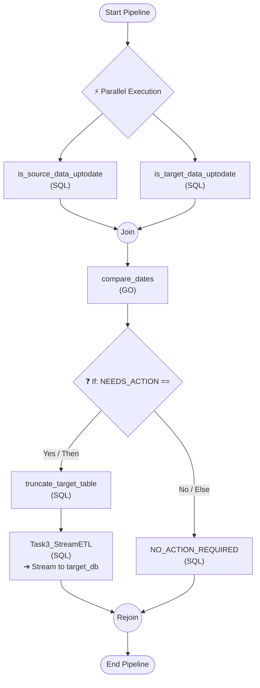

# Pipeline Specification & Flowchart .\examples\check_two_tables_in_parallel_take_action.xml

## Execution Flow Diagram



## Configured Variables

| Name | Type | Default Value |
|---|---|---|
| **Database1ConnStr** | `string` | `sqlserver://T15P:1433?database=PROTO&integrated+security=true&trustServerCertificate=true` |
| **Database2ConnStr** | `string` | `sqlserver://T15P:1433?database=AdventureWorks2019&integrated+security=true&trustServerCertificate=true` |
| **TABLE** | `string` | `[dbo].[GcpBillingExport]` |

## Configured Databases

| Alias Name | Connection String / Variable Reference |
|---|---|
| **source_db** | `{{Database1ConnStr}}` |
| **target_db** | `{{Database2ConnStr}}` |

## SCRIPTS

| Language | ID/Name | XPath Location | Source Database | Target Database | Target Table | Batch Size | Value |
|---|---|---|---|---|---|---|---|
| **sql** | **is_source_data_uptodate** | `/Q{}pipeline[1]/Q{}scripts[1]/Q{}parallel[1]/Q{}script[1]` | `source_db` | `source_db` | `` | `` | <code>SELECT ISNULL(MAX(ExportTime), '1900-01-01') AS SOURCE_MAX_DATE<br/>FROM {{TABLE}};</code> |
| **sql** | **is_target_data_uptodate** | `/Q{}pipeline[1]/Q{}scripts[1]/Q{}parallel[1]/Q{}script[2]` | `target_db` | `target_db` | `` | `` | <code>SELECT ISNULL(MAX(ExportTime), '1900-01-01') AS TARGET_MAX_DATE<br/>FROM {{TABLE}};</code> |
| **go** | **compare_dates** | `/Q{}pipeline[1]/Q{}scripts[1]/Q{}script[1]` | `` | `` | `` | `` | <code>package main<br/>import (<br/>"fmt"<br/>"host/vars"<br/>)<br/>func main() {<br/>source_max_date := vars.GetString("SOURCE_MAX_DATE")<br/>target_max_date := vars.GetString("TARGET_MAX_DATE")<br/>if  source_max_date  != "" && target_max_date != "" && source_max_date != target_max_date {<br/>fmt.Println("true")<br/>} else {<br/>fmt.Println("false")<br/>}<br/>}</code> |
| **sql** | **truncate_target_table** | `/Q{}pipeline[1]/Q{}scripts[1]/Q{}if[1]/Q{}then[1]/Q{}script[1]` | `target_db` | `target_db` | `` | `` | <code>TRUNCATE TABLE {{TABLE}};</code> |
| **sql** | **Task3_StreamETL** | `/Q{}pipeline[1]/Q{}scripts[1]/Q{}if[1]/Q{}then[1]/Q{}script[2]` | `source_db` | `target_db` | `{{TABLE}}` | `5000` | <code>SELECT * FROM {{TABLE}};</code> |
| **sql** | **NO_ACTION_REQUIRED** | `/Q{}pipeline[1]/Q{}scripts[1]/Q{}if[1]/Q{}else[1]/Q{}script[1]` | `target_db` | `target_db` | `` | `` | <code>SELECT 'No action required. Target table is up to date.' AS alert;</code> |

## Results with debiug logging enabled

```code
Pipeline Start Time: 2026-08-22 19:36:58.474
Starting execution of script "is_target_data_uptodate" on database "target_db"
Starting execution of script "is_source_data_uptodate" on database "source_db"
Finished execution of script "is_source_data_uptodate" (duration: 44.5617ms)
Finished execution of script "is_target_data_uptodate" (duration: 45.0652ms)
Starting execution of script "compare_dates"
Finished execution of script "compare_dates" (duration: 3.7994ms)
Starting execution of script "truncate_target_table" on database "target_db"
Finished execution of script "truncate_target_table" (duration: 5.4008ms)
Starting execution of script "Task3_StreamETL" on database "source_db" and target table "{{TABLE}}"
Finished execution of script "Task3_StreamETL" (duration: 346.5948ms)

```

---

| Script ID | Return Code | Results |
| :--- | :--- | :--- |
| is_source_data_uptodate | 0 | SOURCE_MAX_DATE<br>2026-08-22 18:42:30.221436 +0000 +0000<br><br>(1 row(s) returned)<br> |
| is_target_data_uptodate | 0 | TARGET_MAX_DATE<br>1900-01-01 00:00:00 +0000 +0000<br><br>(1 row(s) returned)<br> |
| compare_dates | 0 | true<br> |
| truncate_target_table | 0 | <br><br>(0 row(s) returned)<br> |
| Task3_StreamETL | 0 | Streamed 4623 row(s) directly to target_db.[dbo].[GcpBillingExport]<br> |
Pipeline End Time:   2026-08-22 19:36:58.875
Pipeline Duration:   401.693ms
